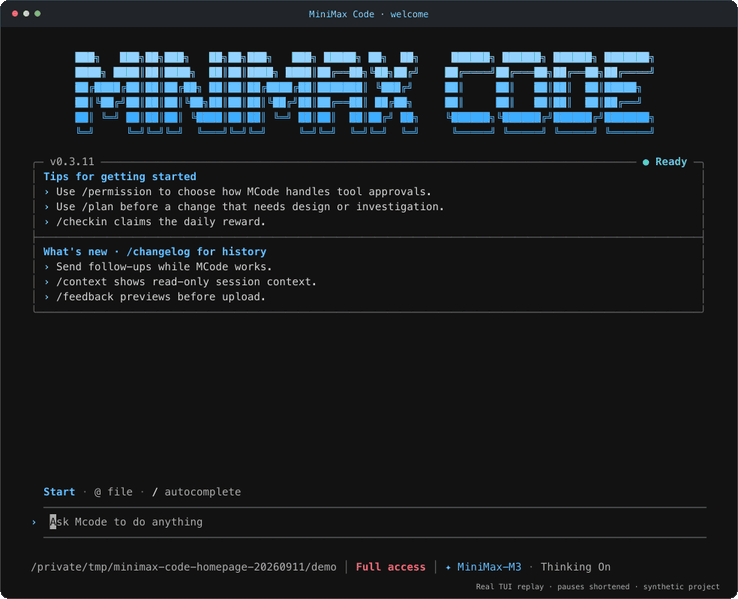

# A real coding task

[Play or download the MP4](assets/tui-demo.mp4) · [View the full-size still](assets/tui-demo.png) · [Example source](../examples/clamp)

## What was recorded

The interactive TUI built from this repository ran in a temporary directory containing only `clamp.mjs` and `clamp.test.mjs`, using an existing Rig Token Plan login and `Rig-M3`. The model actually read the files, ran `node --test`, edited the function, and reran the tests. Initially two failed and one passed; after the fix, all three passed. The test file was unchanged.

The recorded task:

> Read clamp.mjs and clamp.test.mjs. Run node --test to reproduce the failure, fix clamp without changing the tests, then run the tests again. Reply briefly in English.

Full access was used only for this isolated synthetic project. Use `/permission` to choose an appropriate mode for your own work.

## Recording and editing

- Recorded on 2026-09-11 from source commit `fe49bbd73d4bb2df6e5873801af12695378c0b62`, TUI version 0.3.11.
- Actual ANSI output was captured through a PTY and replayed at 110 columns × 36 rows. Application text, colors, and layout are retained; the outer window title and provenance caption are recording decoration.
- The still shows the same session after `Ctrl+O` expanded tool details and the viewport was scrolled upward, including the actual diff and test output.
- The 20-second edit keeps task order, shortens waits and thinking, and holds on the final diff and tests. **It is not real-time playback or a performance benchmark.** No model output, tool calls, or test results were fabricated.
- `@xterm/headless` interpreted terminal cells, which were rendered as SVG / PNG. FFmpeg encoded the GIF and silent H.264 MP4. A border keeps the dark terminal frame visible on both light and dark GitHub backgrounds.
- No private project, account page, or key was recorded, and no user test image was used. Raw recordings and runtime logs remain local and are not committed as release assets.

This demonstrates one small code repair, not acceptance of every project, provider, or tool. See the [verification records](verification.md) for broader evidence.

## Brand assets

The README's light and dark wordmarks use the existing TUI welcome logo, with blue and cyan from its theme. `assets/social-preview.png` is a local 1280 × 640 sharing card for maintainers to configure as the GitHub Social Preview at release time. Creating these assets does not publish the repository; nothing was uploaded to a third-party media host.
